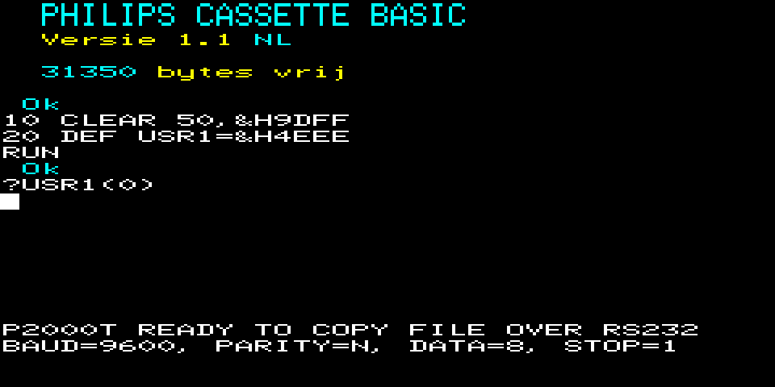

# P2000T RS232 CARTRIDGE

[](https://github.com/ifilot/p2000t-rs232-cartridge/releases/tag/v0.1.1)
[](https://github.com/ifilot/p2000t-rs232-cartridge/actions/workflows/build.yml)
[](https://www.gnu.org/licenses/gpl-3.0)

## Purpose

It is possible to transfer `.CAS` files to the P2000T over the RS232 interface
using the [pc2p2000t tool](https://github.com/p2000t/software/tree/master/utilities/pc2p2000t)
as developed by [dionoid](https://github.com/dionoid). This repository contains
the source code to produce an all-in-one cartridge image that has the required
source code already inserted at the end of the standard BASIC-NL cartridge
allowing the user to only write two lines of BASIC code to start the program.

## Usage

### P2000T

After booting the P2000T with the modified BASIC-NL image, run

```basic
10 CLEAR 50,&H9DFF
20 DEF USR1=&H4EC7
```

> **Note**: Use `&H9DFF` in the above instructions if your P2000T has 16kb of memory. 
> If your P2000T has 32kb or 48kb of memory, use `&HBDFF` or `&HDDFF`, respectively.
> Alternatively, you can also use the following one-liner to let the P2000T
> figure it out for you: `10 CLEAR 50,&H9DFF+256*32*(PEEK(&H605C)+PEEK(&H605C)=1))`.

This very small basic program ensures that BASIC cannot touch the upper 512 bytes
of memory and sets a pointer to custom defined source code. To run this small
snippet of BASIC code, run

```basic
RUN
```

To put the P2000T in 'listening' mode, run

```
?USR1(0)
```

After copying the `.cas` file, your P2000T should beep and you can choose
to either immediately run the program via `RUN` or save it to a cassette
using `CSAVE`.



### PC (Windows)

Insert the USB to RS232 device and open a `Command Prompt` Window. Check COM
device is used for the serial connector and run

```bat
mode com5 baud=9600 parity=n data=8 stop=1
```

Next, copy the CAS file using e.g.

```bat
copy data.cas \\.\com5
```


## Compilation

> **Note**: Rather than building the ROM yourself, you can also download the
> [latest release](https://github.com/ifilot/p2000t-rs232-cartridge/releases/latest)
> directly from Github.

The instructions below are tested on Ubuntu 22.04 and are most likely easily
transferable to other Linux versions.

1. Ensure the right packages are installed:

```bash
sudo apt install python3 python3-numpy z80asm make
```

2. Clone the repository

```bash
git clone git@github.com:ifilot/p2000t-rs232-cartridge.git
```

3. and start the compilation by running

```bash
make
```

## References

* [Relevant forum post](https://www.retroforum.nl/topic/3914-philips-p2000t/page/3/?tab=comments#comment-154818) (Dutch)
* [BASIC and Z80 source code](https://github.com/p2000t/software/tree/master/utilities/pc2p2000t)